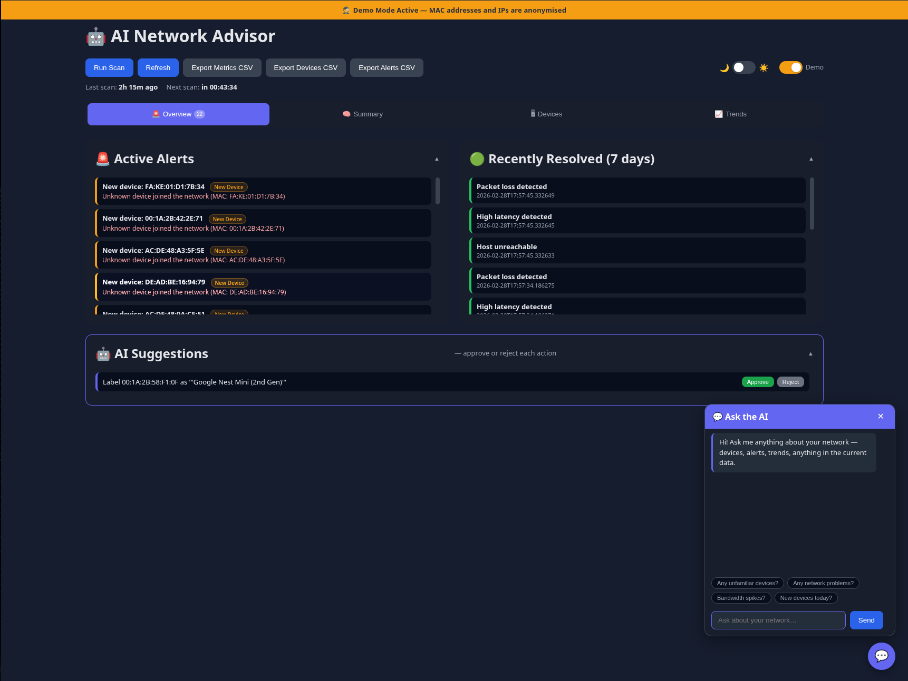
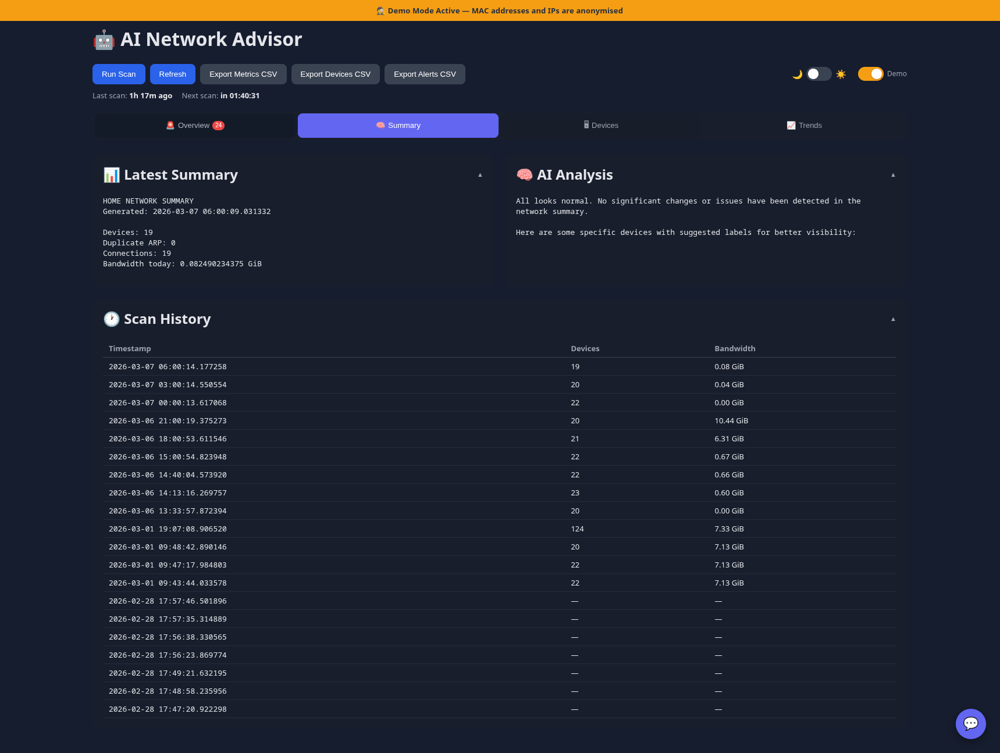
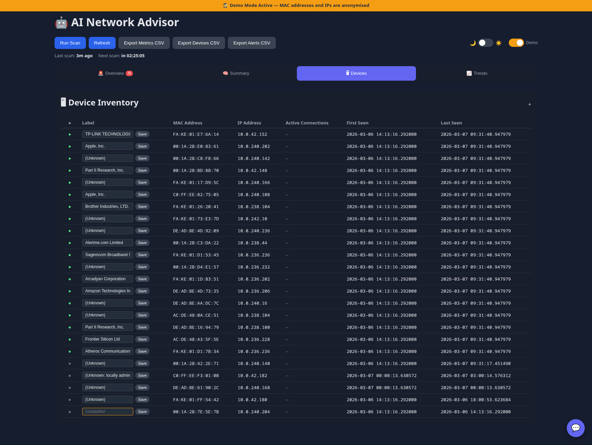
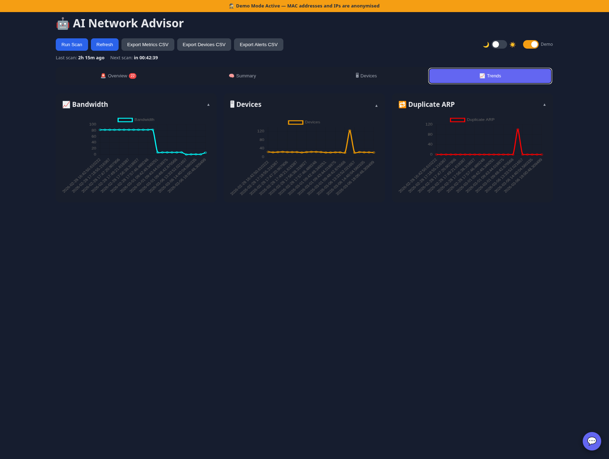

# AI Network Advisor

A self-hosted home network monitoring agent with an AI-powered web dashboard. Scans your LAN on a schedule, analyses trends using a local LLM (no cloud, no API keys), raises alerts for anomalies, and lets you interrogate your network in plain English.

---

## Features

**Monitoring & Scanning**
- ARP scan to discover all devices on the local network
- Bandwidth tracking via `vnstat`
- Active connection counting via `ss`
- Internet connectivity check with latency and packet-loss measurement
- Scheduled scanning via cron (or on-demand from the dashboard)

**AI Analysis**
- Sends scan summaries to a local [Ollama](https://ollama.com) instance running `mistral`
- Compares current metrics against recent history to detect anomalies
- Generates plain-English analysis and actionable suggestions
- Floating AI chat popup available on every page — ask anything about your network
- Suggested starter questions so you know what to ask

**Alerting**
- Threshold-based alerts: high latency (>80ms), packet loss (>5%), host unreachable, gateway unreachable, duplicate ARP, new unknown devices, labelled device offline
- Gateway ping distinguishes LAN outages (router down) from ISP outages (internet down)
- Alerts categorised by type with colour-coded badges (New Device, Packet Loss, Unreachable, Duplicate ARP, High Latency)
- Alert escalation tracking — fires again if a condition persists
- Auto-resolve when a condition clears
- Desktop notifications (via `notify-send`) for critical and warning events
- Cooldown state persisted to SQLite so restarts don't reset alert frequency

**Device Inventory**
- Tracks every MAC address ever seen, with first/last seen timestamps
- Assign human-readable labels to devices (e.g. "David's laptop", "Smart TV")
- Per-device online/offline status — green/grey dot updated every scan; alerts fire when a labelled device disappears and auto-resolve when it returns
- New device alerts include open ports (via optional `nmap` fast scan)
- Click any "New device" alert to see device details in a modal
- Unlabelled devices are visually flagged in the table

**Dashboard**
- Tabbed layout: Overview, Summary, Devices, Trends
- Active alert count badge on the Overview tab
- Dark and light theme with toggle (preference saved to localStorage)
- **Demo Mode** — anonymises all real MAC addresses and IP addresses with consistent fake values throughout the entire dashboard; useful for screenshots and sharing without exposing private network data. Toggle persists across sessions.
- Collapsible cards (state saved to localStorage)
- Scan history table showing the last 20 scans with device count and bandwidth (Summary tab)
- Trend charts for bandwidth, device count, and duplicate ARP events (Chart.js)
- CSV export endpoints for metrics, devices, and alerts — compatible with Power BI and Databricks

**Security**
- HTTP Basic Auth on all routes
- LAN-accessible (binds to `0.0.0.0`) — keep behind a firewall or router NAT
- All AI processing is local — no data leaves your network

---

## Screenshots

> All screenshots taken with **Demo Mode** active — MAC addresses and IPs are anonymised.

**Overview** — active alerts with type badges, recently resolved alerts, AI suggestions, and the floating chat panel



**Summary** — latest scan metrics, plain-English AI analysis, and scan history (last 20 scans with device count and bandwidth)



**Devices** — full device inventory with labels, anonymised MACs and IPs, and active connection counts



**Trends** — historical bandwidth, device count, and duplicate ARP charts



---

## Requirements

### System packages

| Package | Purpose |
|---|---|
| `arp-scan` | LAN device discovery |
| `vnstat` | Bandwidth usage tracking |
| `iproute2` | Active connection counting (`ss` command) |
| `python3` | Runtime (3.10+ required, developed on 3.14) |
| `pip` | Python package installer |

Install on Debian/Ubuntu/Arch:

```bash
# Debian / Ubuntu
sudo apt install arp-scan vnstat iproute2 python3 python3-pip python3-venv

# Arch / CachyOS
sudo pacman -S arp-scan vnstat iproute2 python python-pip
```

### Ollama + Mistral

Ollama runs the LLM locally. Install it and pull the model:

```bash
curl -fsSL https://ollama.com/install.sh | sh
ollama pull mistral
```

Ollama must be running (`ollama serve` or via systemd) before starting a scan. If Ollama is unavailable, the AI analysis step is skipped gracefully — the rest of the scan still runs.

### Python packages

```
flask>=3.0
ping3>=4.0
requests>=2.28
```

These are installed automatically in the venv during setup.

---

## Installation

```bash
# 1. Clone the repository
git clone https://github.com/david-sweetenham/ai-network-agent.git
cd ai-network-agent

# 2. Create and activate a virtual environment
python3 -m venv venv
source venv/bin/activate

# 3. Install Python dependencies
pip install flask ping3 requests

# 4. Make the helper scripts executable
chmod +x run_scan.sh start_dashboard.sh
```

### Change the default credentials

> [!CAUTION]
> **Do this before running the dashboard.** The default credentials are `admin` / `changeme` and are public knowledge because this is an open-source repository. Anyone on your network can log in with those credentials until you change them.

Edit [dashboard.py](dashboard.py) and update these two lines near the top:

```python
DASHBOARD_USER = "admin"
DASHBOARD_PASS = "changeme"   # <-- change this
```

The Flask dev server does not support HTTPS. Do not expose port 5000 to the internet — keep it behind your router/firewall and treat it as a LAN-only tool.

---

## Running

### Start the web dashboard

```bash
./start_dashboard.sh
```

The dashboard will be available at `http://<your-machine-ip>:5000` from any device on your LAN.

### Run a manual scan (CLI)

```bash
./run_scan.sh
```

This collects metrics, requests an AI analysis, saves results to the database, and evaluates alerts. Output is printed to stdout.

You can also trigger a scan from the dashboard using the **Run Scan** button, which runs the same logic inline and redirects back to the refreshed dashboard.

### Schedule automatic scans with cron

```bash
crontab -e
```

Add a line to scan every 3 hours (adjust the path to match your install location):

```cron
0 */3 * * * /home/david/ai-network-agent/run_scan.sh >> /home/david/ai-network-agent/scan.log 2>&1
```

---

## Docker

Docker is the recommended way to run this on a dedicated machine such as a Raspberry Pi or home server. It handles all system and Python dependencies automatically.

### Prerequisites

- Docker and Docker Compose installed
- **Ollama running on the host machine** (not inside Docker) with the `mistral` model pulled — see [Requirements](#requirements)
- `vnstatd` running on the host and collecting traffic data
- Linux host — `network_mode: host` is not supported on Docker Desktop for macOS or Windows

### Quick start

```bash
# 1. Clone the repository
git clone https://github.com/david-sweetenham/ai-network-agent.git
cd ai-network-agent

# 2. Create the database file — required before first run.
#    If this file is missing, Docker creates a directory here instead,
#    which causes SQLite to fail.
touch network_history.db

# 3. Build and start the container
docker-compose up -d

# 4. Follow the logs
docker-compose logs -f
```

The dashboard will be available at `http://<host-ip>:5000` immediately.

### Run a manual scan (Docker)

```bash
docker exec ai-network-advisor python network_summary.py
```

### Schedule automatic scans with cron (Docker)

```bash
crontab -e
```

```cron
0 */3 * * * docker exec ai-network-advisor python network_summary.py >> /var/log/network-scan.log 2>&1
```

### Change credentials (Docker)

> [!CAUTION]
> Change the default credentials before starting the container. See the [credentials warning](#change-the-default-credentials) above.

Edit `dashboard.py` to update `DASHBOARD_USER` and `DASHBOARD_PASS`, then rebuild:

```bash
docker-compose up -d --build
```

### Why `network_mode: host`?

`arp-scan` needs to send raw Ethernet frames on your physical network interface. Docker's default bridge networking isolates the container from the LAN, so arp-scan would only see other Docker containers rather than your real devices. Host networking gives the container direct access to the host's network stack, solving this cleanly. It also means Ollama at `localhost:11434` is reachable without any extra configuration.

---

## Data exports

Three CSV endpoints are available for integration with external tools:

| Endpoint | Contents |
|---|---|
| `/export/metrics.csv` | Historical metric readings (timestamp, device count, bandwidth, etc.) |
| `/export/devices.csv` | Full device inventory with first/last seen timestamps |
| `/export/alerts.csv` | Complete alert history including resolved alerts |

These can be used as a "Get Data from Web" source in Power BI, or fetched via `requests.get()` in a Databricks notebook.

---

## Project structure

```
ai-network-agent/
├── network_summary.py   # Data collection, DB schema, AI query, alert bridging
├── alerts.py            # Alert dataclass, storage, and threshold engine
├── dashboard.py         # Flask app; full HTML/CSS/JS as inline template string
├── run_scan.sh          # CLI entry point — safe to run from cron
├── start_dashboard.sh   # Starts the Flask dev server
├── Dockerfile           # Container image definition
├── docker-compose.yml   # Service definition with host networking and volumes
├── requirements.txt     # Python dependencies
└── network_history.db   # SQLite database (created on first run)
```

### Database tables

| Table | Contents |
|---|---|
| `metrics` | One row per scan: timestamp, device count, bandwidth, connections, duplicate ARP |
| `summaries` | Raw scan text and AI analysis from each run |
| `devices` | Device inventory: MAC, IP, first/last seen, label |
| `alerts` | Alert history with level, title, message, resolved flag, fire count |
| `alert_cooldowns` | Persisted cooldown state so alert frequency survives restarts |
| `pending_actions` | AI-suggested actions awaiting approval or rejection |

---

## Tech stack

| Layer | Technology |
|---|---|
| Language | Python 3 |
| Web framework | Flask 3 |
| Database | SQLite (via `sqlite3` stdlib) |
| AI / LLM | Ollama (local) + Mistral 7B |
| Network scanning | `arp-scan`, `ping3`, `vnstat`, `ss` |
| Frontend charts | Chart.js (CDN) |
| Frontend styles | Vanilla CSS with custom properties (no framework) |
| Auth | HTTP Basic Auth |

No external AI APIs, no Docker required, no cloud dependencies. Everything runs on the local machine.

---

## Security

> [!WARNING]
> This tool is designed for **personal home network use only**. It is not suitable for production environments or networks you do not own and have permission to monitor.

- Only run this on networks you own or have explicit permission to scan. ARP scanning without authorisation may be illegal in your jurisdiction.
- The Flask development server has no HTTPS support. Keep port 5000 behind your router and do not expose it to the internet.
- HTTP Basic Auth sends credentials in base64 (not encrypted) over the connection. On a home LAN this is generally acceptable; over the internet it is not.
- Change the default credentials (`admin` / `changeme`) before first use — see [above](#change-the-default-credentials).

---

## Disclaimer

This software is provided for educational and personal home-use purposes. The author accepts no responsibility for misuse, data loss, network disruption, security incidents, or any other damages arising from use of this software. Use it on your own network, at your own risk, and in compliance with the laws of your jurisdiction.

---

## Licence

MIT — see [LICENSE](LICENSE).

---

## Notes

- `arp-scan` requires root or `CAP_NET_RAW`. If you run into permission errors, either run as root or set the capability: `sudo setcap cap_net_raw+ep $(which arp-scan)`
- `vnstat` must have been collecting data for at least one monitoring period before bandwidth figures appear
- The Flask server runs in debug mode (`debug=True`) which is fine for a home network tool but should not be exposed to the internet
